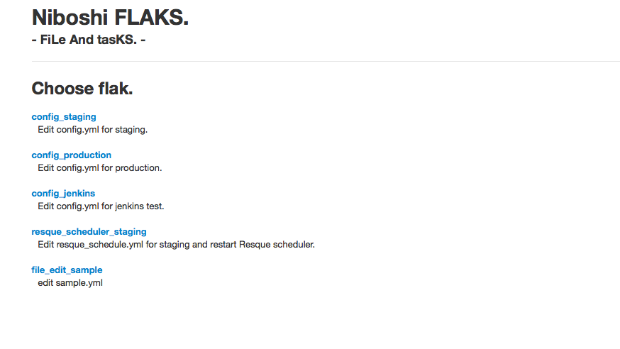

# FLAKS(Files and Tasks)

FLAKS is a very simple server management tool.

It has two features.

- edit local file from web-ui.
- execute comand from web-ui.

## Preview Image

### Top



### Files and Tasks


## Setup

```
bundle install --deployment --path=vendor/bundle
```

## Configration

see [./config/flaks.yml.sample](./config/flaks.yml.sample)

Configsets are sepalated by namespace.


### Files

Updaate local file.

path: filepath  
type: format (No effect. Reserved for additional features)

```
  files:
    id1:
      path: /tmp/hoge.yml
      type: yaml
    id2:
      path: /tmp/hoge.json
      type: json
```

### Tasks

Execute command and returns stdout.

label: short name  
desc: long descrption  
task: command line  

```
  tasks:
    id1:
      label: test task
      desc: hogehoge STDOUT
      task: "echo hogehoge"
    id2:
      label: test task
      desc: hogehoge STDOUT
      task: "echo piyopiyo"
```


## Launch

```
bundle exec rackup
```


## LICENSE

MIT

